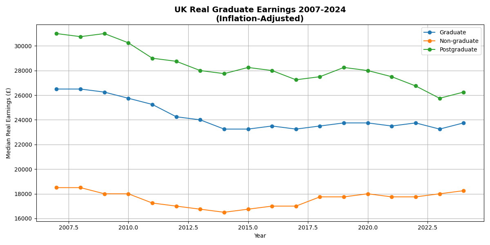
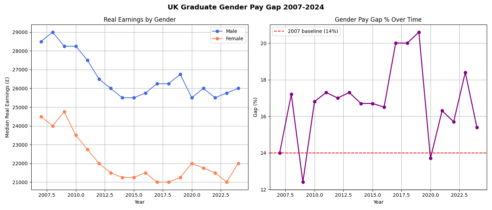

# UK Graduate Labour Market Analysis 📊

## Overview
Analysis of 17 years of official UK government data (2007-2024) on graduate 
earnings, examining the graduate premium and gender pay gap using ONS Labour 
Force Survey data across 324 clean data points.

## Key Findings

### 1. The Graduate Premium Is Shrinking

- **2007 graduate median: £26,500 → 2024: £23,750.** A real terms fall of £2,750.
- **Postgraduates hit hardest.** Real earnings dropped from £31,000 to £26,250.
- The gap between graduate and non-graduate earnings has **narrowed** over 17 years.
- In real terms, a degree is worth less today than it was in 2007.

### 2. The Gender Pay Gap Has Widened

- **2007 gender pay gap: 14%.** Male graduates earned £4,000 more.
- **Peak gap: 20.6% in 2019.** The gap widened significantly despite equality initiatives.
- **2024 gap: 15.4%.** Still above where it started 17 years ago.
- Despite nearly two decades of corporate diversity pledges, female graduates 
  earn significantly less than their male counterparts in real terms.

## The Uncomfortable Truth
University tuition fees trebled in 2012. Graduate real earnings have fallen 
since 2007. The gender pay gap is wider than it was before the financial crisis.

The return on a UK degree is not what it was and women are bearing a 
disproportionate share of that decline.

## Data Source
Office for National Statistics — Graduate Labour Market Statistics 2024
Annual Survey of Hours and Earnings (ASHE)

## Tech Stack
- Python 3.9
- Pandas
- Matplotlib
